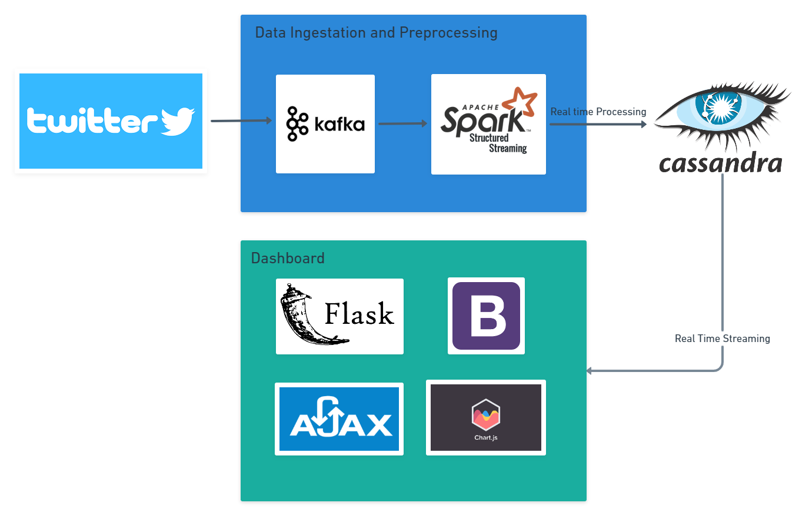
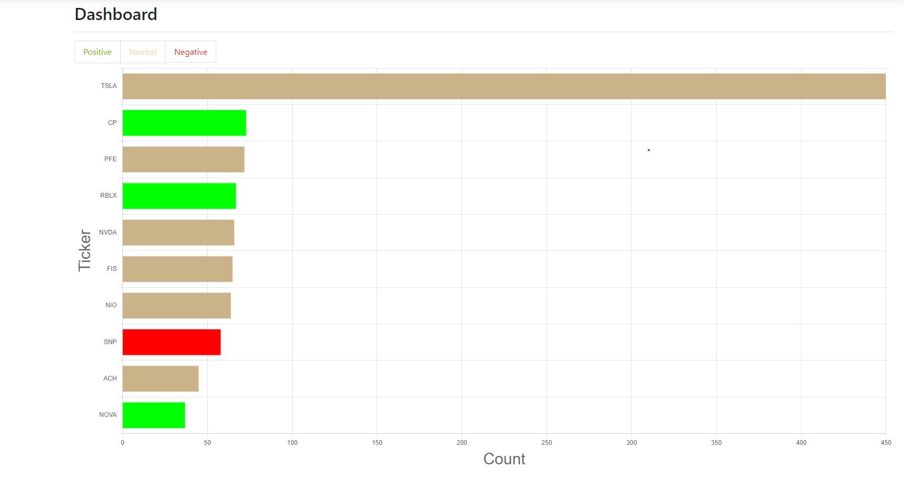

## Real Time Tweets Sentiment Analysis for Tickers

This project analyses the top 250 tickers from the NASDAQ listing and generate sentiment scores using [VaderSentiment](https://www.nltk.org/_modules/nltk/sentiment/vader.html) from the nltk library.

## Pipeline



The application works by pulling data from twitter using their developers API, tweets are then sent to Kafka for redistribution to the various consumers that require the data that the tweets topics container. For the real time dashboard, the data is preprocessed by Spark Structured Streaming which allows for batch computation on the real time data. This is where your standard text preprocessing comes into play such as cleaning of punctuation, classifying the tickers that each tweets are referring to etc. (Refer to src/data_pipeline/tweets_preprocessing.py for more granularity)

The preprocessed data is then written to a Cassandra database. Cassandra is a column-centric NoSQL database that have strong emphasis on availability and the ability to handle large amount of data which is crucial when dealing with real time streams of data. This is due to the lack of a single point of failure and replication function. (although we are using a SimpleStrategy with 1 node)

The web framework of choice for the dashboard itself is Flask, which is a lightweight framework with the benefits of ease of working for small scale applications. The data is read from Cassandra using the relevant queries and then fed to the frontend where the graph is displayed using ChartJS and continously updated by Ajax.

## Setting Up

### Docker
Ensure that Docker and Docker Compose is installed in your machine, you can install Docker [here](https://docs.docker.com/get-docker/) and Docker compose [here](https://docs.docker.com/compose/install/)

### Python
It is generally good practice to have an environment, you can create a new Python 3.8.5 environment using either Anaconda or virtualenv. Activate your newly created environment and run this command in the root directory
```
pip install -r requirements.txt
```
which will install all the required package to run this application

### Twitter
1. You will need to obtain the relevant twitter credentials from twitter's developer program in order to access tweets via their API. You can apply for access via this [link](https://developer.twitter.com/en/apply-for-access)

2. Once your account is set up, you create a project and obtain your keys and tokens, all the required keys and tokens can be obtained from the same page under the keys section of your project

3. Create an .env file in the root directory and fill the file according to this template
```
BEARER_TOKEN=$BEARER_TOKEN
CONSUMER_KEY=$CONSUMER_KEY
CONSUMER_SECRET=$CONSUMER_SECRET
ACCESS_TOKEN=$ACCESS_TOKEN
ACCESS_TOKEN_SECRET=$ACCESS_TOKEN_sECRET
```

where you replace the variables with your personal token and secret.

4. This step is crucial as the docker-compose file will access the .env file for the relevant variables and access twitter using the appropriate credentials.

### Cassandra
You will also need to install Cassandra 4.0.0 where you can follow the guide [here](https://cassandra.apache.org/doc/latest/cassandra/getting_started/installing.html)

## Getting Started

1. Run the docker-compose.yml file in the root directory using this command
```
sudo docker-compose build
sudo docker-compose up
```

This will create the Kafka broker and also the tweet producer python script

2. The next step is to start Cassandra, how you do it depends on how you initially installed it.
```
# If installed using tarball
$CASSANDRA_ROOT/bin/cassandra

# Using debian package
cassandra
```

3. If you have not created the relevant keyspace and table in Cassandra, you can run use the tweet_table.cql script in the script folder

```
# If installed using tarball
$CASSANDRA_ROOT/bin/cqlsh -f /$PROJECT_ROOT/script/tweet_table.cql

# Using debian package - Run in project root
cqlsh -f script/tweet_table.cql
```

4. After creating the relevant keyspace and table using the cql script, run the spark_submit.sh shell script in the root directory that handles all the relevant packages for spark-submit

```
sh spark_submit.sh
```
The Cassandra keyspace should be populated.

5. Run the flask app using the command in the root directory
```
python -m src.app.app
```
Go to the relevant ip address and the graph should be populated similar to this
, note that the graph will be updating in real time with no animations